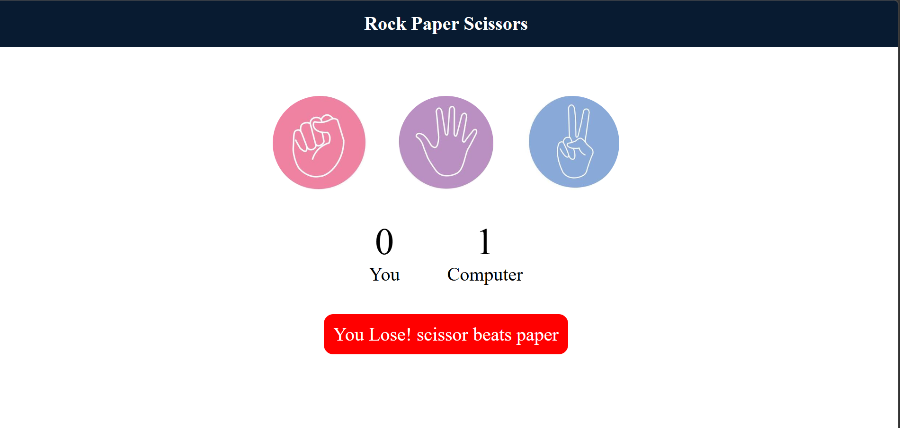

# 🎮 Rock Paper Scissors Game

## 📌 Description

An interactive Rock Paper Scissors game built using HTML, CSS, and JavaScript. The game allows users to play against the computer with real-time results and score tracking.

---

## 🚀 Features

* 🎯 User vs Computer gameplay
* 🔢 Live score tracking
* ⚡ Instant result display
* 🎨 Dynamic UI updates

---

## 🛠️ Tech Stack

* HTML
* CSS
* JavaScript

---

## 🌐 Live Demo

👉 # 🎮 Rock Paper Scissors Game

## 📌 Description

An interactive Rock Paper Scissors game built using HTML, CSS, and JavaScript. The game allows users to play against the computer with real-time results and score tracking.

---

## 🚀 Features

* 🎯 User vs Computer gameplay
* 🔢 Live score tracking
* ⚡ Instant result display
* 🎨 Dynamic UI updates

---

## 🛠️ Tech Stack

* HTML
* CSS
* JavaScript

---

## 🌐 Live Demo

👉 https://Manya12381.github.io/Rock-Paper-Scissors/

---

## 📷 Screenshot

---
## 📚 What I Learned

* DOM Manipulation
* Event Handling
* Game Logic Implementation
* Git & GitHub usage

---

## 👩‍💻 Author

* Manya Rawat
